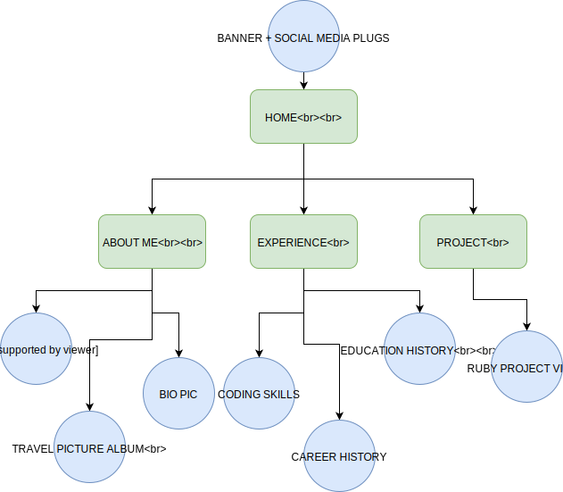
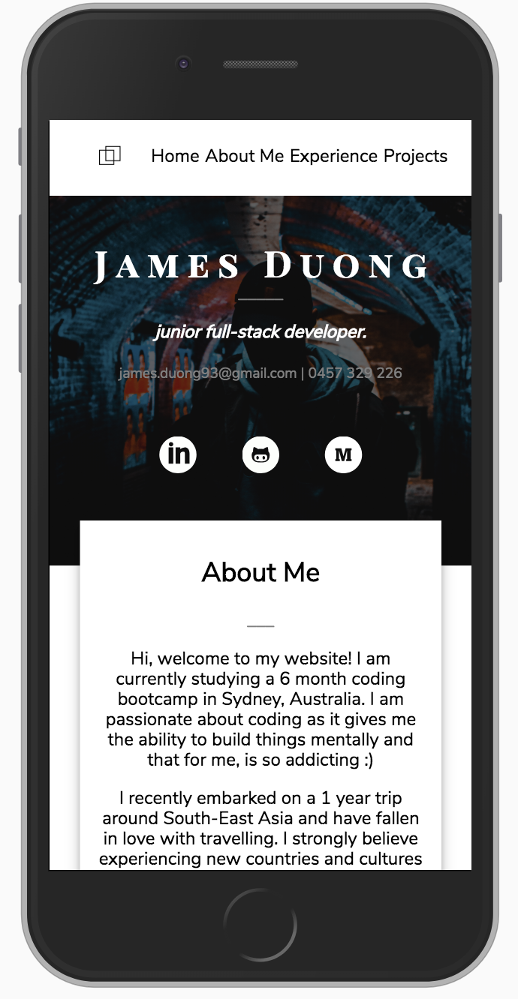
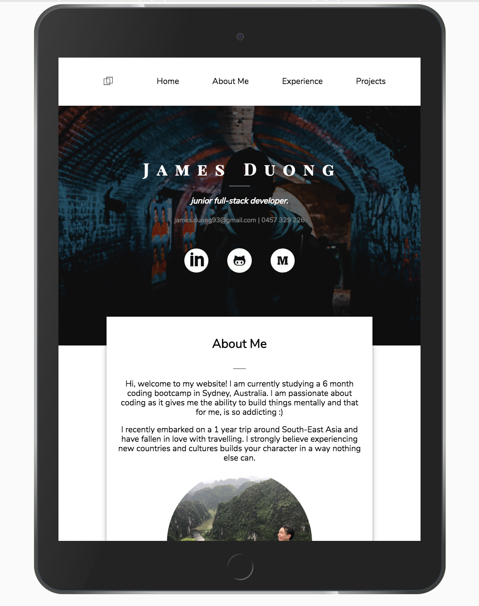
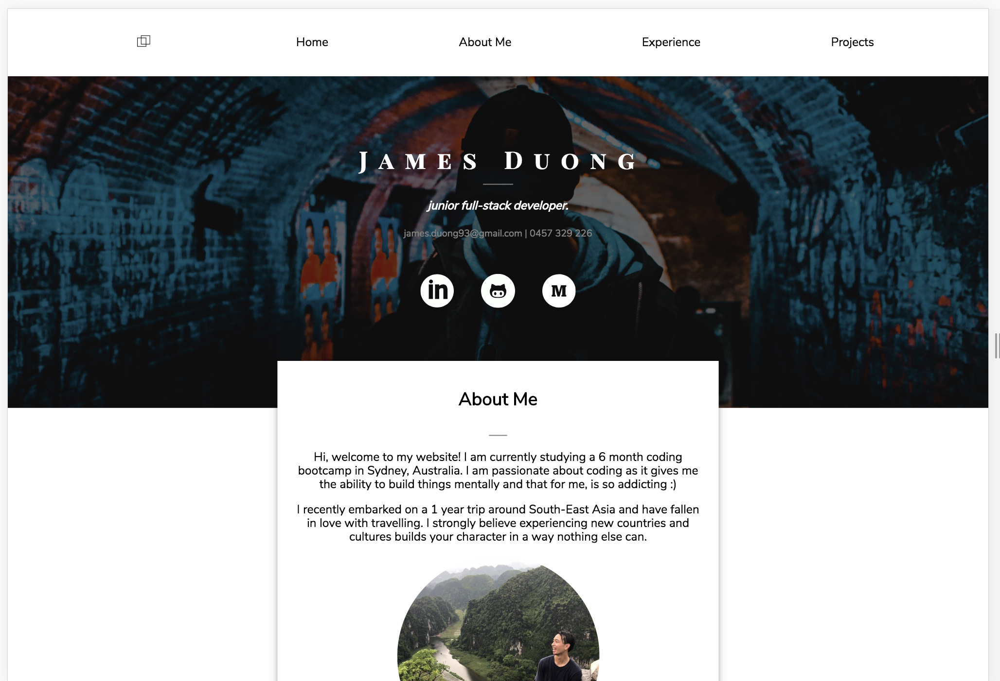
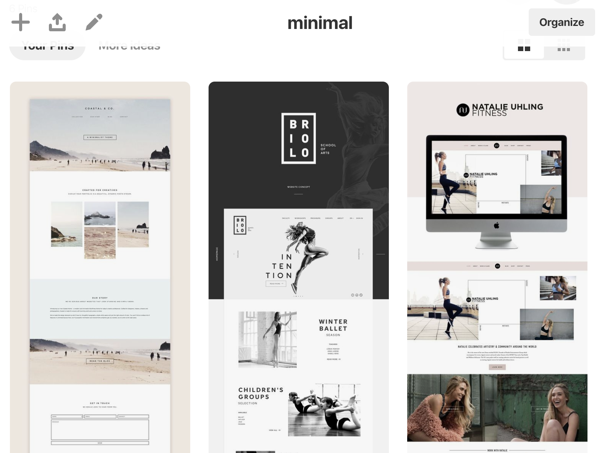
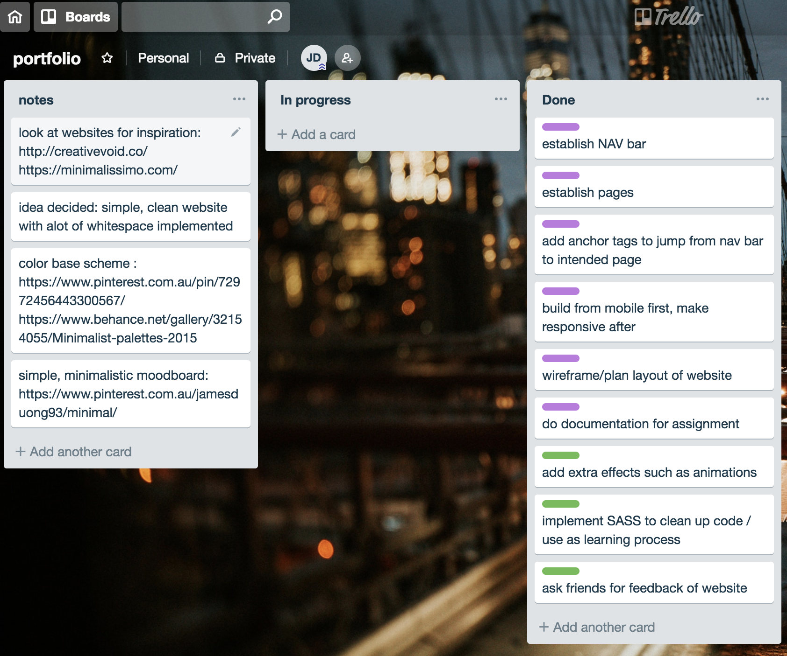

# Portfolio Website
======

[Portfolio Website](https://jamesphongduong.github.io/website/)  
[GitHub Repo](https://github.com/jamesphongduong/website)

## Description of website
======
The purpose of my portfolio website is primarily for personal branding, a platform where I am able to showcase my personal identity and skills to potential employers. The website has simple functionality, with a navigation bar to help access parts of the website. It contains photos, a video, plugs to social media and personal contact information. I used HTML5, CSS3, SCSS and Flexbox and CSS Grid to create this website.  

### Sitemap
======

### How it looks on different devices

## Design Documentation
======
### Design process
======

I viewed https://www.awwwards.com/ and Pinterest to help find website inspiration and ideas. As this was my first website, I wanted to make a simple website that had the right balance between applying what I’d learnt in class and also challenging myself to implementing ideas outside of the classroom. 
I used Pinterest to make a board that included color and layout ideas. I also used Trello to break the project plan into blocks,placing priority value on each activity. 

Logical navigation was implemented with minimal layout. Lots of white-spacing was used and font size is increased if the device has gone past tablet size to help readability. 
All images were labelled with alternate text with a clear image description. 
Personal Logo was selected from a “free icon provider” website. 

### Wireframes
======

### Project Plan and Timeline 
======
Day 1
Brainstorm, look for inspiration, decide on theme,color palette and layout
Day 2
Start wireframe process for Mobile Design, laying out all elements 
Day 3 
Start coding HTML with the content I want on my website, and collect photos and icons 
Day 4
Start coding CSS and styling elements 
Day 5 
Finish the mobile design (HTML and CSS component). Use SASS while cleaning up code.
Day 6 
Establish responsiveness to website by implementing media queries. Add “extras” to website such as touching up color and fancy effects. Finish documentation and prepare for presentation. 

### Trello Board
======

## Q & A
======
### Describe key events in the development of the internet from the 1980s to today
======
1980s - Dave Farber, professor of Computer Science opened a project to build an inexpensive network using dial-up phones. This project expanded internet access and allowed for email communication between several nations. 

1990s - Tim Berners-Lee and his colleagues at CERN (European Organization for Nuclear Research) established HTML (Hypertext Markup Language) and the URL (Uniform Resources Locator) opening the introduction of the World Wide Web.

2000 - The Dot-com bubble (a.k.a the Internet Bubble) occured. As website companies became more mainstream, people started to invest in tech companies that were over-valued.  Consequently, the bubble burst when these companies went bankrupt and the over-valued industry led to many investors pulling their money out. 

2004 - Facebook goes viral and the era of social networking begins. 

2012 - SOPA (Stop Online Piracy Act) and PIPA (Protect IP Act) were bills introduced in the US Congress, with the intention to provide more robust responses to copyright infringement. More than 115,000 websites joined together to protest against the bills. 

### Define and describes the relationship between fundamental aspects of the internet such as: domains, web servers, DNS, and web browsers
====== 

A web browser is a software application that allows us to access information on the World Wide Web. Common examples are Google Chrome, Firefox and Internet Explorer. 

Web servers is a computer that runs websites. The purpose of a web server is to store, process and deliver web pages to the user. 

A domain is the human-readable web address (e.g. google.com) that points to to a computer-readable web address (155.135.55.94) that allows users to access websites in a convenient way. 

A DNS (Domain Name Server) is the internet’s version of a phone book. They maintain a directory of domain names and their corresponding IP address. 

In a practical context, when we search for a web address, our ISP (Internet Service Provider) views the DNS associated with the domain name, and translates it into a computer friendly IP address, allowing us to direct to the intended website.  

### Reflect on one aspect of the development of internet technologies and how it has contributed to the world today
======

It is predicted that by 2020, Artificial Intelligent (AI) could be completely operating warehouse logistics. This disruptive technology has the ability to revolutionise the way our current industries are run today, from automating human jobs and increasing business operation efficiency. 

The most obvious benefit of using robots is having downtime of work, where lunchbreak and differing shift patterns are not factors. Amazon’s Kiva robots are able to pick up goods and distribute to different stations in the warehouse in just a few minutes, and only require 5 minutes charging time per hour. 

Ocado (famous British online supermarket) has its own AI technology named, Ocado Technology, having the ability to learn new ways/algorithms to filter through customer emails, placing a priority value on them and determining what kind of request it is, whether it requires contacting the customer or if the customer is simply passing on good feedback.

